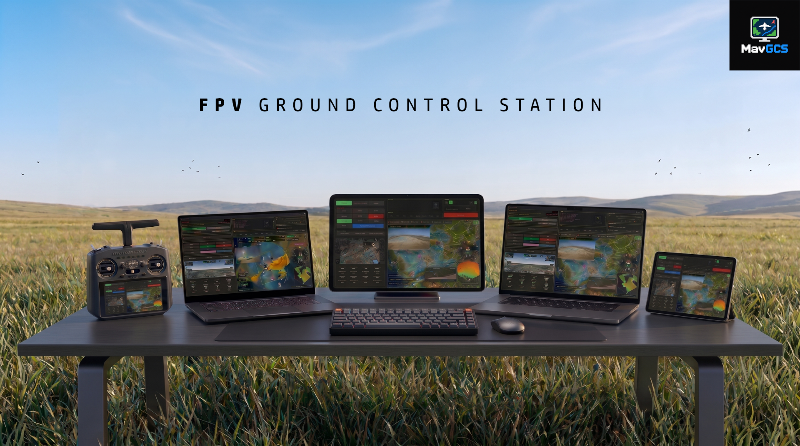

## 
Ground Control Station for ArduPilot & PX4, INAV.

 
 
 
 
 

  

A ground control station software for **MAVLink** protocol, for iPhone. 🛩️

It works with **Ardupilot**, **PX4** (Bi-directional) or **INAV** (Uni-directional).

Supports MAVLink over WiFi telemetry bridges such as mLRS, ELRS and LTE
telemetry, over UDP or TCP.

The iPhone member of MavGCS: simpler than the desktop and Android
versions, and made to be carried. You can monitor HUD, vital information
about flight and the health of eight onboard systems, follow the vehicle
on a satellite map, use weather radar, view terrain radar, Live AGL and a
compass with the way home, keep terrain for flying without a signal, arm
and disarm, change flight modes, fly to a point by tapping the map, and
get directions to the aircraft in Google Maps.

There is a desktop version for Windows and macOS,
[MavGCS](https://github.com/kolabuzlu/MavGCS), and an Android version,
[MavGCS Android](https://github.com/kolabuzlu/MavGCS-Android).

Created by **Derin Hakan Karakurt**
